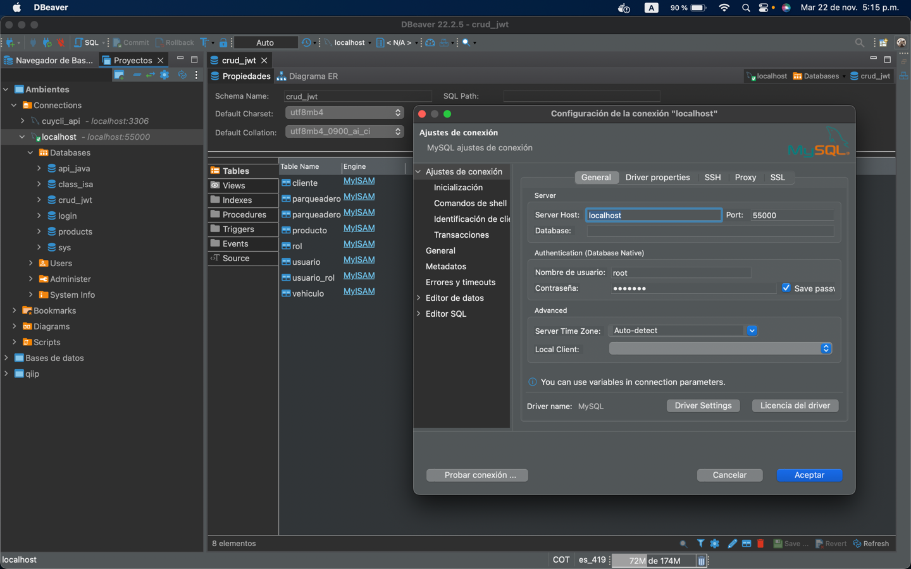
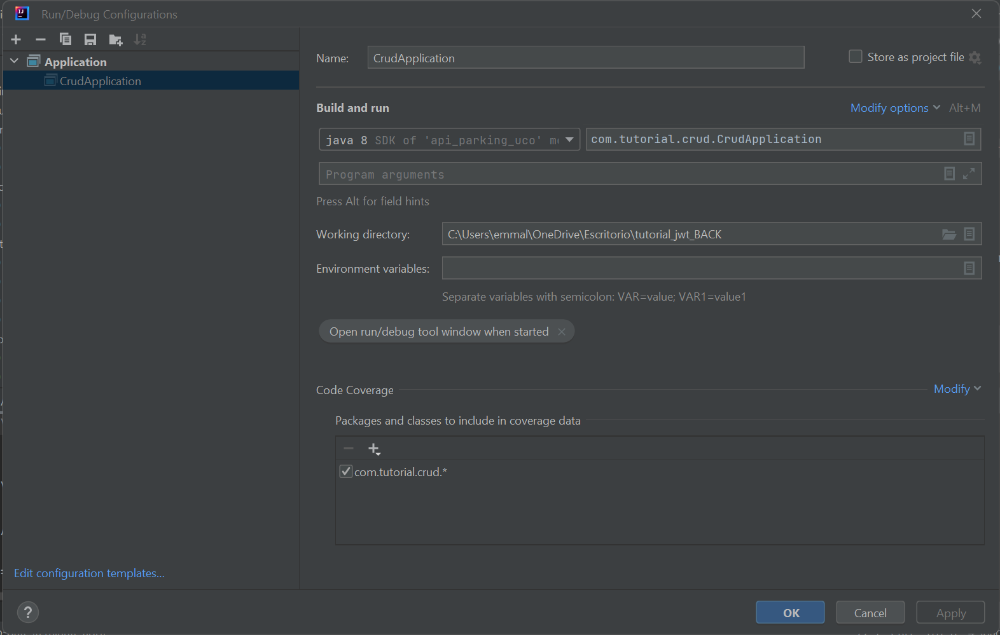

# API PARKING UCO

### REQUIREMENTS
Versiónes estables para el proyecto:

- Java v.11
- maven

### Kickoff

+ Clona este repositorio

``git clone https://github.com/champion19/api-parking``
+ Instalar dependencias

``mvn install`` or ``mvn package``

+ Tener instalado un gestor de base de datos y configurarlo en
``application.properties`` del proyecto

+ Ejemplo configuración Base de datos en Dbeaver consumiendo un ambiente Dockerizado

  

+ Elimina las etiquetas de comentario y ejecuta el archivo
``util/CreateRoles``

+ Iniciar aplicación en Intellij

+ Sigue los pasos descriptos en la imagen

